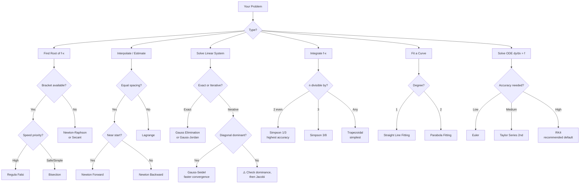
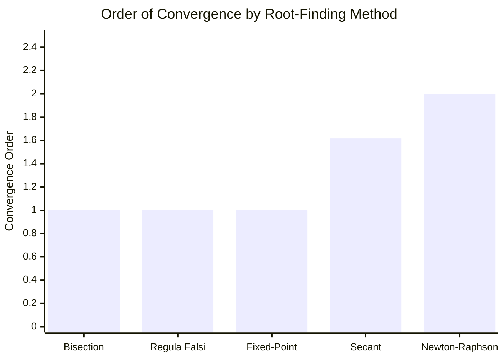
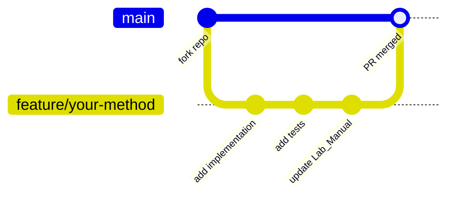

<div align="center">

<h1>
  <br>
  📐 CBNST — Numerical Methods in C
  <br>
</h1>

<h4>A complete, university-grade library of numerical algorithms — robust, double-precision, zero-warning C99.</h4>

<p align="center">
  <a href="https://en.cppreference.com/w/c/99">
    
  </a>
  <a href="LICENSE">
    
  </a>
  <a href="Makefile">
    
  </a>
  
  
  
</p>

<p align="center">
  <a href="#-quick-start">Quick Start</a> •
  <a href="#-algorithms">Algorithms</a> •
  <a href="#-architecture">Architecture</a> •
  <a href="#-usage">Usage</a> •
  <a href="#-sample-io">Sample I/O</a> •
  <a href="#-contributing">Contributing</a>
</p>

</div>

---

## 📌 What Is This?

**CBNST** (Computer Based Numerical & Statistical Techniques) is a clean, modern C99 library implementing **21 production-quality numerical algorithms** across 6 categories. Every implementation is:

- 🔒 **Numerically stable** — `double` precision throughout, no `float`
- 🛡️ **Defensively coded** — division-by-zero guards, singularity detection, max-iteration caps
- ✅ **Standard compliant** — compiles with `-Wall -Wextra -Werror`, zero warnings
- 📚 **Curriculum-aligned** — maps directly to BSc / BCA / MCA / BTech CBNST syllabi
- 🧪 **Validated** — automated Python test runner with expected outputs

If you're a student preparing for practical exams, a lecturer building a lab reference, or a developer needing a portable C baseline for numerical work — this is built for you.

---

## ⚡ Quick Start

> **Prerequisites:** `gcc` (≥ 9.0) and `make`. On Ubuntu/Debian: `sudo apt install build-essential`

```bash
# 1. Clone
git clone https://github.com/sr-857/Numerical-Methods.git
cd Numerical-Methods

# 2. Build everything
make

# 3. Run any method
./bisection
./rk4
./gauss_elimination
```

That's it. No external dependencies. No cmake. No package manager.

---

## 📚 Algorithms

### 🔍 Root-Finding Methods

| Method | File | Order | Key Formula |
|--------|------|-------|-------------|
| Bisection | `Bisection_Method.c` | Linear (1) | $c = a + \frac{b-a}{2}$ |
| Regula Falsi | `Regula_Falsi_Method.c` | Linear (1) | $c = \frac{a \cdot f(b) - b \cdot f(a)}{f(b) - f(a)}$ |
| Newton-Raphson | `Newton_Raphson.c` | Quadratic (2) | $x_{n+1} = x_n - \frac{f(x_n)}{f'(x_n)}$ |
| Secant | `Secant_Method.c` | Superlinear (≈1.618) | $x_{n+1} = \frac{x_{n-1} f(x_n) - x_n f(x_{n-1})}{f(x_n) - f(x_{n-1})}$ |
| Fixed-Point Iteration | `Iteration_Method.c` | Linear (1) | $x_{n+1} = g(x_n)$, requires $\|g'(x)\| < 1$ |

### 📈 Interpolation Methods

| Method | File | Data Spacing | Best For |
|--------|------|-------------|----------|
| Newton Forward | `Newton_Forward_Interpolation_Method.c` | Equal | Near the start of a table |
| Newton Backward | `Newton_Backward_Interpolation_Method.c` | Equal | Near the end of a table |
| Lagrange | `Lagrange_Interpolation_Method.c` | Arbitrary | Any scattered data |

### 🔢 Systems of Linear Equations

| Method | File | Type | Notes |
|--------|------|------|-------|
| Gauss Elimination | `Gauss_Elimination.c` | Direct | Partial pivoting |
| Gauss-Jordan | `Gauss_Jordan.c` | Direct | Full row reduction |
| Gauss-Jacobi | `Gauss_Jacobi.c` | Iterative | Requires diagonal dominance |
| Gauss-Seidel | `Gauss_Seidel.c` | Iterative | Faster convergence than Jacobi |
| Matrix Inversion | `Matrix_Inversion.c` | Direct | Augmented $[A\|I] \to [I\|A^{-1}]$ |

### ∫ Numerical Integration

| Method | File | Error Order | Constraint |
|--------|------|------------|------------|
| Trapezoidal Rule | `Trapezoidal_Rule.c` | $O(h^2)$ | None |
| Simpson's 1/3 Rule | `Simpson_1_by_3_Rule.c` | $O(h^4)$ | $n$ must be **even** |
| Simpson's 3/8 Rule | `Simpson_3_by_8_Rule.c` | $O(h^4)$ | $n$ must be **divisible by 3** |

### 📉 Curve Fitting

| Method | File | Model |
|--------|------|-------|
| Straight Line Fitting | `Fit_Straight_Line_Curve_Fitting.c` | $y = a + bx$ |
| Parabola Fitting | `Fit_Parabola_Curve_Fitting.c` | $y = a + bx + cx^2$ |

### 🌊 Ordinary Differential Equations

| Method | File | Error Order |
|--------|------|------------|
| Euler's Method | `Euler_Method.c` | $O(h)$ |
| Taylor Series (2nd Order) | `Taylor_Series_Method.c` | $O(h^2)$ |
| Runge-Kutta 4 (RK4) | `Runge_Kutta_Method.c` | $O(h^4)$ |

---

## 🏗️ Architecture

### Repository Layout

```
Numerical-Methods/
├── 📄 README.md
├── 📄 Lab_Manual.md          ← Aim, Algorithm, Viva Q&A for every method
├── 📄 audit_report.md        ← Numerical stability code review
├── 🛠️ Makefile               ← One-command build for all 21 targets
├── 🐍 test_runner.py         ← Automated validation against expected outputs
│
├── Root-Finding/
│   ├── Bisection_Method.c
│   ├── Regula_Falsi_Method.c
│   ├── Newton_Raphson.c
│   ├── Secant_Method.c
│   └── Iteration_Method.c
│
├── Interpolation/
│   ├── Newton_Forward_Interpolation_Method.c
│   ├── Newton_Backward_Interpolation_Method.c
│   └── Lagrange_Interpolation_Method.c
│
├── Linear_Systems/
│   ├── Gauss_Elimination.c
│   ├── Gauss_Jordan.c
│   ├── Gauss_Jacobi.c
│   ├── Gauss_Seidel.c
│   └── Matrix_Inversion.c
│
├── Integration/
│   ├── Trapezoidal_Rule.c
│   ├── Simpson_1_by_3_Rule.c
│   └── Simpson_3_by_8_Rule.c
│
├── Curve_Fitting/
│   ├── Fit_Straight_Line_Curve_Fitting.c
│   └── Fit_Parabola_Curve_Fitting.c
│
└── ODEs/
    ├── Euler_Method.c
    ├── Taylor_Series_Method.c
    └── Runge_Kutta_Method.c
```

### Algorithm Selection Flowchart



### Convergence & Complexity Summary



| Method | Time | Space | Conv. Order | Critical Guard |
|--------|------|-------|-------------|----------------|
| Bisection | $O(\log\frac{b-a}{\epsilon})$ | $O(1)$ | 1 | $f(a) \cdot f(b) < 0$ |
| Regula Falsi | $O(n)$ | $O(1)$ | 1 | Denominator $\neq 0$ |
| Newton-Raphson | $O(n)$ | $O(1)$ | 2 | $f'(x_n) \neq 0$ |
| Secant | $O(n)$ | $O(1)$ | 1.618 | $f(x_n) \neq f(x_{n-1})$ |
| Newton Fwd/Bwd | $O(n^2)$ | $O(n^2)$ | — | Equal spacing |
| Gauss Elimination | $O(n^3)$ | $O(n^2)$ | — | Partial pivoting |
| Gauss Jacobi/Seidel | $O(kn^2)$ | $O(n^2)$ | — | Diagonal dominance |
| Trapezoidal | $O(n)$ | $O(1)$ | $O(h^2)$ | $n > 0$ |
| Simpson 1/3 | $O(n)$ | $O(1)$ | $O(h^4)$ | $n$ even |
| RK4 | $O(\text{steps})$ | $O(1)$ | $O(h^4)$ | $h > 0$ |

---

## 🚀 Installation and Setup

### Option A — Make (Recommended)

```bash
git clone https://github.com/sr-857/Numerical-Methods.git
cd Numerical-Methods

make          # compile all 21 programs
make clean    # remove all binaries
```

### Option B — Manual GCC Compilation

```bash
# Example: compile only what you need
gcc -std=c99 -Wall -Wextra -Werror -o newton_raphson Newton_Raphson.c -lm
gcc -std=c99 -Wall -Wextra -Werror -o rk4 Runge_Kutta_Method.c -lm
gcc -std=c99 -Wall -Wextra -Werror -o gauss_elimination Gauss_Elimination.c -lm
```

<details>
<summary>📋 Full compilation commands for all 21 methods</summary>

```bash
# Root-Finding
gcc -std=c99 -Wall -Wextra -Werror -o bisection        Bisection_Method.c              -lm
gcc -std=c99 -Wall -Wextra -Werror -o regula_falsi     Regula_Falsi_Method.c           -lm
gcc -std=c99 -Wall -Wextra -Werror -o newton_raphson   Newton_Raphson.c                -lm
gcc -std=c99 -Wall -Wextra -Werror -o secant           Secant_Method.c                 -lm
gcc -std=c99 -Wall -Wextra -Werror -o iteration        Iteration_Method.c              -lm

# Interpolation
gcc -std=c99 -Wall -Wextra -Werror -o newton_forward   Newton_Forward_Interpolation_Method.c  -lm
gcc -std=c99 -Wall -Wextra -Werror -o newton_backward  Newton_Backward_Interpolation_Method.c -lm
gcc -std=c99 -Wall -Wextra -Werror -o lagrange         Lagrange_Interpolation_Method.c        -lm

# Linear Systems
gcc -std=c99 -Wall -Wextra -Werror -o gauss_elimination Gauss_Elimination.c  -lm
gcc -std=c99 -Wall -Wextra -Werror -o gauss_jordan      Gauss_Jordan.c       -lm
gcc -std=c99 -Wall -Wextra -Werror -o gauss_jacobi      Gauss_Jacobi.c       -lm
gcc -std=c99 -Wall -Wextra -Werror -o gauss_seidel      Gauss_Seidel.c       -lm
gcc -std=c99 -Wall -Wextra -Werror -o matrix_inversion  Matrix_Inversion.c   -lm

# Integration
gcc -std=c99 -Wall -Wextra -Werror -o trapezoidal  Trapezoidal_Rule.c      -lm
gcc -std=c99 -Wall -Wextra -Werror -o simpson_1_3  Simpson_1_by_3_Rule.c   -lm
gcc -std=c99 -Wall -Wextra -Werror -o simpson_3_8  Simpson_3_by_8_Rule.c   -lm

# Curve Fitting
gcc -std=c99 -Wall -Wextra -Werror -o fit_line     Fit_Straight_Line_Curve_Fitting.c -lm
gcc -std=c99 -Wall -Wextra -Werror -o fit_parabola Fit_Parabola_Curve_Fitting.c      -lm

# ODEs
gcc -std=c99 -Wall -Wextra -Werror -o euler  Euler_Method.c        -lm
gcc -std=c99 -Wall -Wextra -Werror -o taylor Taylor_Series_Method.c -lm
gcc -std=c99 -Wall -Wextra -Werror -o rk4    Runge_Kutta_Method.c  -lm
```
</details>

---

## 💻 Usage

### Running a Program

Every program is interactive — it prompts you for input and prints formatted results.

```bash
./bisection
# Enter lower bound (a): 2
# Enter upper bound (b): 3
# Enter tolerance: 0.0001
# Enter max iterations: 100

# Iter |       a       |       b       |       c       |     f(c)
# -----+---------------+---------------+---------------+----------
#    1 |  2.000000000  |  3.000000000  |  2.500000000  | +5.625000
#    2 |  2.000000000  |  2.500000000  |  2.250000000  | +1.890625
#  ...
#   14 |  2.094482422  |  2.094604492  |  2.094543457  | +0.000022
#
# Root ≈ 2.094551
```

### Running Automated Tests

```bash
python3 test_runner.py
```

The test runner compiles each program, feeds it known inputs, and validates outputs against expected values.

---

## 📊 Sample I/O

### Root-Finding — $f(x) = x^3 - 2x - 5 = 0$

| Method | Input | Expected Root |
|--------|-------|---------------|
| Bisection | `a=2, b=3, tol=0.0001` | `2.094551` |
| Regula Falsi | `a=2, b=3, tol=0.0001` | `2.094551` |
| Newton-Raphson | `x0=2.0, tol=0.0001` | `2.094551` |
| Secant | `x0=2, x1=3, tol=0.0001` | `2.094551` |

### Linear System — Gauss Elimination / Jacobi / Seidel

```
System:   20x +  y - 2z = 17
           3x + 20y -  z = -18
           2x -  3y + 20z = 25
```

```
Solution:  x = 1.000000   y = -1.000000   z = 1.000000
```

### Numerical Integration — $\int_0^6 \frac{1}{1+x^2} \, dx$

| Method | Intervals | Result |
|--------|-----------|--------|
| Simpson's 1/3 | 6 (even) | `≈ 1.366174` |
| Simpson's 3/8 | 6 (÷3) | `≈ 1.357081` |
| Trapezoidal | 6 | `≈ 1.410798` |

> **Note:** True value $= \arctan(6) \approx 1.4056476$. Simpson's 1/3 achieves $O(h^4)$ accuracy.

### ODE — $\frac{dy}{dx} = x + y$, $y(0) = 1$, $h = 0.1$

| Method | $y(0.5)$ approx | Error vs Exact |
|--------|-----------------|----------------|
| Euler | `1.715610` | ~1.8% |
| Taylor (2nd) | `1.796580` | ~0.1% |
| RK4 | `1.797439` | ~0.001% |

---

## 🧩 Design Decisions

### Why C99 and not C++/Python?

Most university CBNST curricula specify C as the implementation language. C99 is the sweet spot: it gives us `//` comments, `<stdbool.h>`, VLAs (used carefully), and `<stdint.h>` while remaining universally portable across lab environments.

### Why `double` everywhere?

`float` (32-bit) gives roughly 7 significant digits. `double` (64-bit) gives 15–16. For iterative algorithms — particularly Gauss-Jacobi and RK4 — accumulated rounding in `float` arithmetic can cause silent, incorrect convergence. All variables are `double`; all format strings use `%.6lf` or higher precision.

### Safety Guards Philosophy

Every program defensively checks:
- **Bracket validity** before bisection-family methods
- **Denominator non-zero** before any division
- **Diagonal dominance** before iterative solvers (with a warning, not a hard stop)
- **Matrix singularity** via pivot magnitude threshold
- **Max iterations cap** to prevent infinite loops in divergent cases

---

## 🔧 Troubleshooting

| Problem | Likely Cause | Fix |
|---------|-------------|-----|
| `undefined reference to sqrt` / `pow` | Missing math linker flag | Add `-lm` to your `gcc` command |
| `error: implicit declaration of function` | Wrong C standard | Use `-std=c99` or `-std=c11` |
| Program loops forever | No max iteration guard in custom modification | The originals all have `MAX_ITER`; restore it |
| Jacobi/Seidel doesn't converge | Matrix not diagonally dominant | Reorder equations so the largest coefficients are on the diagonal |
| Simpson's 1/3 gives wrong answer | Odd number of intervals | $n$ **must be even** for Simpson's 1/3 |
| Bisection fails to start | $f(a)$ and $f(b)$ have same sign | Choose a different bracket where root is guaranteed |
| `Segmentation fault` on large $n$ | Stack overflow from large VLA | Reduce $n$ or switch to heap allocation |

---

## 🤝 Contributing

Contributions are welcome — bug fixes, new methods, or improved documentation.



**Contribution Checklist:**

- [ ] Compiles with `gcc -std=c99 -Wall -Wextra -Werror` — zero warnings
- [ ] Uses `double` (not `float`) for all floating-point values
- [ ] Includes max-iteration guard for any iterative loop
- [ ] Validates all user inputs before use
- [ ] Adds a corresponding entry to `Lab_Manual.md` (Aim, Algorithm, Viva Q&A)
- [ ] Adds expected output to `test_runner.py`

```bash
# Standard contribution workflow
git fork https://github.com/sr-857/Numerical-Methods.git
git checkout -b feature/your-method-name
# ... implement, test ...
git commit -m "feat: add Muller's method for complex roots"
git push origin feature/your-method-name
# Open Pull Request on GitHub
```

---

## 📖 Lab Manual

The [`Lab_Manual.md`](./Lab_Manual.md) contains a complete university-format write-up for every method:

- **Aim** — Objective statement
- **Theory** — Mathematical background
- **Algorithm** — Step-by-step pseudocode
- **Code** — The C implementation
- **Sample Output** — Expected terminal output
- **Viva Questions** — 5–10 exam-style Q&A per method

This is designed to be printed or submitted as a practical file for university examinations.

---

## 📜 License

Distributed under the MIT License. See [`LICENSE`](LICENSE) for full terms.

---

## 👤 Author

**Subhajit Roy**

- GitHub: [@sr-857](https://github.com/sr-857)

---

<div align="center">

If this helped you pass your practical exam or saved you debugging time — a ⭐ on GitHub is appreciated.

</div>
