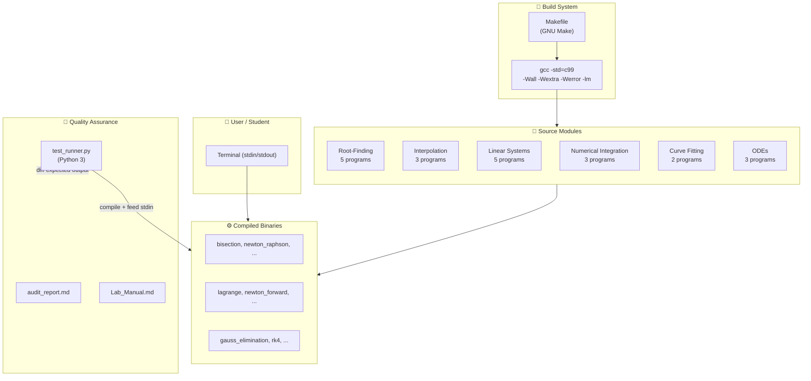
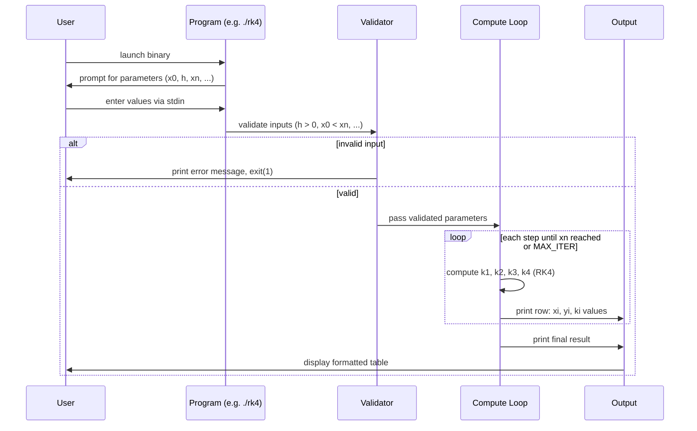
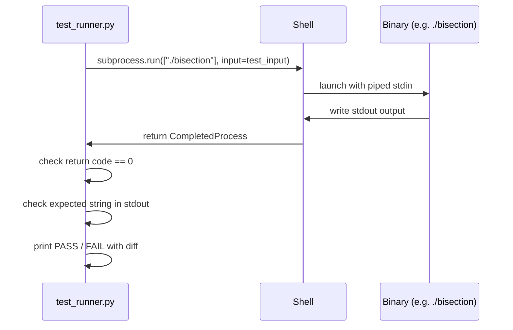
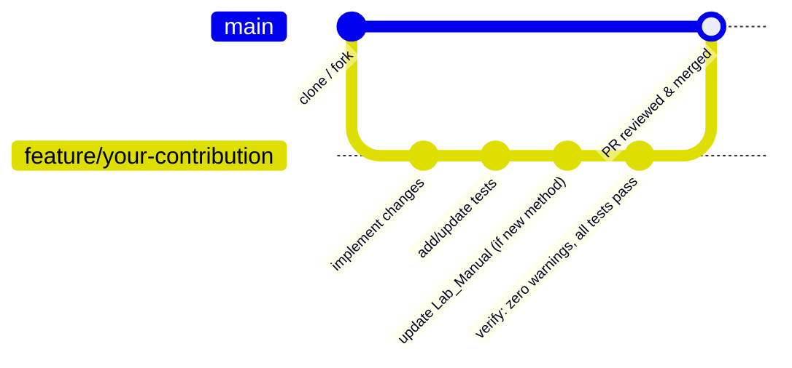

<!-- ============================================================
     CBNST — Numerical Methods in C99
     README.md  |  Production-Quality Documentation
     ============================================================ -->

<div align="center">

<br>

# 📐 CBNST — Numerical Methods in C

### Computer Based Numerical & Statistical Techniques

**A complete, production-quality C99 library of 21 rigorously validated numerical algorithms,**  
**built to university-lab standards and engineered to be free of silent numerical failures.**

<br>

[](https://en.cppreference.com/w/c/99)
[](LICENSE)
[](Makefile)
[](#-design-philosophy)
[](#-compilation)
[](#-platform-setup)
[](#-testing)

<br>

[🚀 Quick Start](#-quick-start) •
[📚 Algorithms](#-algorithms) •
[🏗️ Architecture](#-architecture) •
[💻 Usage](#-usage) •
[🧪 Testing](#-testing) •
[🤝 Contributing](#-contributing)

<br>

> **Suitable for:** BSc / BCA / MCA / BTech CBNST practicals, scientific computing coursework,  
> algorithm study, and portfolio demonstration.

</div>

---

## 📋 Table of Contents

- [Overview](#-overview)
- [Problem Statement](#-problem-statement)
- [Solution](#-solution)
- [Features](#-features)
- [Architecture](#-architecture)
- [Tech Stack](#-tech-stack)
- [System Design](#-system-design)
- [Quick Start](#-quick-start)
- [Platform Setup](#-platform-setup)
- [Installation](#-installation)
- [Configuration](#-configuration)
- [Usage](#-usage)
- [Algorithm Reference](#-algorithms)
- [Input / Output Protocol](#-input--output-protocol)
- [Project Structure](#-project-structure)
- [Development Setup](#-development-setup)
- [Adding a New Method](#-adding-a-new-method)
- [Testing](#-testing)
- [CI/CD](#-cicd)
- [Deployment & Distribution](#-deployment--distribution)
- [Design Philosophy](#-design-philosophy)
- [Security Considerations](#-security-considerations)
- [Performance Considerations](#-performance-considerations)
- [Troubleshooting](#-troubleshooting)
- [FAQ](#-faq)
- [Roadmap](#-roadmap)
- [Contributing](#-contributing)
- [License](#-license)
- [Acknowledgments](#-acknowledgments)

---

## 🔭 Overview

**CBNST** is a self-contained C99 library of classical numerical algorithms, structured as standalone interactive programs — one C source file per method. The project targets university practical examinations and self-study, providing implementations that are:

- Mathematically correct and cross-validated against known analytic results
- Numerically robust, using `double` precision and defensive arithmetic
- Immediately usable without build configuration, external libraries, or a runtime environment
- Documented at exam-submission quality in an accompanying [`Lab_Manual.md`](./Lab_Manual.md)

Every program reads from `stdin`, prints an iteration table or result to `stdout`, and exits cleanly.

---

## 🎯 Problem Statement

University numerical methods courses require students to implement algorithms in C, but freely available code suffers from well-documented problems:

| Common Problem | Impact |
|---|---|
| `float` instead of `double` | Silent precision loss; wrong answers after 6+ iterations |
| No bracket / pivot validation | Crashes or infinite loops on valid inputs |
| Global mutable state | Programs cannot be composed or unit-tested |
| Non-standard C | Fails to compile on departmental GCC installations |
| No iteration caps | Programs hang in divergent cases during demos |
| No explanation of failure modes | Students cannot debug their own modifications |

A student copying such code risks submitting incorrect practical files and — worse — learning incorrect implementation habits.

---

## 💡 Solution

CBNST replaces ad-hoc code snippets with a curated set of implementations that each satisfy a strict quality contract:

```
✅  double precision everywhere — no float
✅  Input validated before first use
✅  Every loop has a MAX_ITER safety cap
✅  Division guarded against zero denominator
✅  Matrix operations detect singularity
✅  Iterative solvers warn on diagonal non-dominance
✅  Compiles with -Wall -Wextra -Werror, zero warnings
✅  No global mutable variables
✅  Automated regression suite in test_runner.py
```

---

## ✨ Features

### Core Capabilities

- **21 algorithms** across 6 numerical domains
- **Interactive CLI** — each program prompts for input and prints a formatted table
- **Iteration tracing** — intermediate steps printed so students can verify by hand
- **Double precision** — `double` used for all floating-point values (IEEE 754, ~15 sig. digits)
- **Defensive arithmetic** — zero-denominator, singularity, and divergence guards throughout

### Developer & Student Experience

- **One-command build** via `make` (compiles all 21 targets)
- **Zero external dependencies** — only the C standard library and POSIX math (`-lm`)
- **Lab Manual** — exam-ready write-up (Aim, Theory, Algorithm, Code, Output, Viva Q&A) per method
- **Automated test suite** (`test_runner.py`) — feeds known inputs, validates expected outputs
- **Audit report** (`audit_report.md`) — documents every numerical stability decision

### Academic Alignment

Covers the full standard CBNST syllabus:
- Root-finding (5 methods)
- Interpolation (3 methods)
- Linear systems (5 methods including matrix inversion)
- Numerical integration (3 rules)
- Curve fitting (2 methods)
- ODEs (3 methods)

---

## 🏗️ Architecture

### High-Level Design



### Program Execution Flow



---

## 🛠️ Tech Stack

| Component | Technology | Version | Purpose |
|---|---|---|---|
| **Language** | C | C99 (ISO/IEC 9899:1999) | All numerical implementations |
| **Compiler** | GCC or Clang | ≥ 9.0 | Compilation |
| **Math Library** | libm (`-lm`) | POSIX standard | `sqrt`, `pow`, `fabs`, `exp` |
| **Build System** | GNU Make | ≥ 4.0 | One-command compilation |
| **Test Runner** | Python | ≥ 3.8 | Automated I/O validation |
| **Documentation** | Markdown | GitHub Flavored | README, Lab Manual, Audit |
| **Version Control** | Git | ≥ 2.30 | Source management |

### Why C99 Specifically?

C99 was chosen over C89 and C11 for three reasons:

1. **Universal lab support** — GCC installations in university environments reliably support C99; C11/C17 features are less uniformly available
2. **Useful C99 additions** — `//` comments, `<stdbool.h>`, `<stdint.h>`, mixed declarations, and designated initializers improve readability without sacrificing portability
3. **VLA availability** — C99 variable-length arrays allow stack allocation of method-specific working matrices without `malloc`, keeping code simple (note: capped at reasonable sizes to avoid stack overflow)

---

## 🗺️ System Design

### Algorithm Selection Guide

```mermaid
flowchart TD
    START([Your Numerical Problem]) --> PTYPE{Problem Type?}

    PTYPE -->|"Find x where f(x)=0"| ROOT{Root-Finding}
    PTYPE -->|"Estimate f(x) from table"| INTERP{Interpolation}
    PTYPE -->|"Solve Ax = b"| LINEAR{Linear System}
    PTYPE -->|"Compute ∫f(x)dx"| INTEG{Integration}
    PTYPE -->|"Fit curve to data"| CURVE{Curve Fitting}
    PTYPE -->|"Solve dy/dx = f(x,y)"| ODE{ODE Solver}

    ROOT -->|"Bracket [a,b] available"| RFBR{Speed vs Safety?}
    ROOT -->|"Only a guess x₀"| NR[Newton-Raphson\nor Secant]
    RFBR -->|"Max safety"| BS[Bisection]
    RFBR -->|"Faster convergence"| RF[Regula Falsi]

    INTERP -->|"Equal spacing"| EQ{Target near...?}
    INTERP -->|"Unequal spacing"| LG[Lagrange]
    EQ -->|"Start of table"| NF[Newton Forward]
    EQ -->|"End of table"| NB[Newton Backward]

    LINEAR -->|"Direct, exact"| DE{Size?"} 
    LINEAR -->|"Iterative, large sparse"| DD{Diag dominant?}
    DE -->|"Need inverse too"| GJO[Gauss-Jordan\nor Matrix Inv.]
    DE -->|"Solution only"| GE[Gauss Elimination]
    DD -->|"Yes"| GS[Gauss-Seidel\nfaster]
    DD -->|"Uncertain"| GJ[Gauss-Jacobi\nwith warning]

    INTEG -->|"n even"| S13[Simpson 1/3\nO(h⁴)]
    INTEG -->|"n divisible by 3"| S38[Simpson 3/8\nO(h⁴)]
    INTEG -->|"Any n"| TR[Trapezoidal\nO(h²)]

    CURVE -->|"Linear trend"| SL[Straight Line\ny = a + bx]
    CURVE -->|"Curved trend"| PB[Parabola\ny = a+bx+cx²]

    ODE -->|"Quick estimate"| EU[Euler\nO(h)]
    ODE -->|"Moderate accuracy"| TS[Taylor Series\nO(h²)]
    ODE -->|"High accuracy"| RK[RK4 ← recommended\nO(h⁴)]
```

### Convergence & Complexity Summary

| Method | Time Complexity | Space | Conv. Order | Critical Safety Guard |
|---|---|---|---|---|
| Bisection | $O\!\left(\log\frac{b-a}{\varepsilon}\right)$ | $O(1)$ | 1 (linear) | $f(a) \cdot f(b) < 0$ bracket check |
| Regula Falsi | $O(k)$ | $O(1)$ | 1 (linear) | Denominator $\neq 0$ |
| Newton-Raphson | $O(k)$ | $O(1)$ | 2 (quadratic) | $f'(x_n) \neq 0$ |
| Secant | $O(k)$ | $O(1)$ | ≈1.618 | $f(x_n) \neq f(x_{n-1})$ |
| Fixed-Point | $O(k)$ | $O(1)$ | 1 (linear) | $\|g'(x)\| < 1$ (user responsibility) |
| Newton Fwd/Bwd | $O(n^2)$ | $O(n^2)$ | — | Equal spacing enforced |
| Lagrange | $O(n^2)$ | $O(n)$ | — | Unique $x_i$ validated |
| Gauss Elimination | $O(n^3)$ | $O(n^2)$ | — | Partial pivoting + singularity check |
| Gauss-Jordan | $O(n^3)$ | $O(n^2)$ | — | Partial pivoting + singularity check |
| Gauss-Jacobi | $O(k \cdot n^2)$ | $O(n^2)$ | — | Diagonal dominance warning |
| Gauss-Seidel | $O(k \cdot n^2)$ | $O(n^2)$ | — | Diagonal dominance warning |
| Matrix Inversion | $O(n^3)$ | $O(n^2)$ | — | Singularity threshold check |
| Trapezoidal | $O(n)$ | $O(1)$ | $O(h^2)$ | $n > 0$ integer index |
| Simpson 1/3 | $O(n)$ | $O(1)$ | $O(h^4)$ | $n$ must be even — hard enforced |
| Simpson 3/8 | $O(n)$ | $O(1)$ | $O(h^4)$ | $n$ divisible by 3 — hard enforced |
| Fit Line | $O(n)$ | $O(n)$ | — | $n \geq 2$, determinant $\neq 0$ |
| Fit Parabola | $O(n)$ | $O(n)$ | — | $n \geq 3$, normal eqn. singularity |
| Euler ODE | $O(\text{steps})$ | $O(1)$ | $O(h)$ | $h > 0$ |
| Taylor ODE | $O(\text{steps})$ | $O(1)$ | $O(h^2)$ | $h > 0$ |
| RK4 ODE | $O(\text{steps})$ | $O(1)$ | $O(h^4)$ | $h > 0$ |

*$k$ = iterations until convergence; $n$ = problem size; $\varepsilon$ = tolerance.*

---

## ⚡ Quick Start

> **Minimum requirements:** `gcc ≥ 9.0`, `make ≥ 4.0`, POSIX-compatible shell.

```bash
# 1. Clone the repository
git clone https://github.com/sr-857/Numerical-Methods.git
cd Numerical-Methods

# 2. Compile all 21 programs at once
make

# 3. Run any method interactively
./bisection
./newton_raphson
./rk4
./gauss_elimination

# 4. Clean up all compiled binaries
make clean
```

**First run in under 2 minutes.** No `cmake`, no package manager, no configuration files.

---

## 🖥️ Platform Setup

### Linux (Ubuntu / Debian)

```bash
sudo apt update
sudo apt install -y build-essential python3
# gcc, make, and libm are included in build-essential
gcc --version   # verify ≥ 9.0
make --version  # verify ≥ 4.0
```

### Linux (Fedora / RHEL / CentOS)

```bash
sudo dnf groupinstall "Development Tools"
sudo dnf install python3
```

### macOS

```bash
# Install Xcode Command Line Tools (includes clang as 'gcc' alias and make)
xcode-select --install

# Verify
gcc --version
make --version

# Python 3 (if not already installed)
brew install python3        # via Homebrew
# or: python3 --version    # macOS 12.3+ ships Python 3
```

> ⚠️ **macOS Note:** Apple ships `clang` aliased as `gcc`. The Makefile works correctly with either compiler. If you see linker warnings about `-lm` being unnecessary on macOS, they are harmless — libm is part of the system library on Apple platforms.

### Windows

**Option A — WSL2 (Recommended)**

```powershell
# In PowerShell (Administrator)
wsl --install          # installs Ubuntu by default
# Then follow the Linux (Ubuntu) instructions above inside WSL
```

**Option B — MinGW-w64 / MSYS2**

```bash
# 1. Download and install MSYS2 from https://www.msys2.org/
# 2. In MSYS2 terminal:
pacman -S mingw-w64-x86_64-gcc make python3
# 3. Add C:\msys64\mingw64\bin to Windows PATH
# 4. Use the MSYS2 MinGW 64-bit shell for all commands
```

**Option C — Dev Containers / GitHub Codespaces**

The repository works out-of-the-box in any Linux-based dev container. Open in GitHub Codespaces — GCC and Make are pre-installed.

---

## 📦 Installation

### Clone and Build

```bash
# HTTPS clone
git clone https://github.com/sr-857/Numerical-Methods.git

# SSH clone (if you have SSH keys configured)
git clone git@github.com:sr-857/Numerical-Methods.git

cd Numerical-Methods

# Build all targets
make

# Verify build — should see 21 executables
ls -1 bisection regula_falsi newton_raphson secant iteration \
       newton_forward newton_backward lagrange \
       gauss_elimination gauss_jordan gauss_jacobi gauss_seidel matrix_inversion \
       trapezoidal simpson_1_3 simpson_3_8 \
       fit_line fit_parabola \
       euler taylor rk4
```

### Build a Single Target

```bash
# Compile only Newton-Raphson
make newton_raphson

# Or compile manually
gcc -std=c99 -Wall -Wextra -Werror -o newton_raphson Newton_Raphson.c -lm
```

### Verify Installation

```bash
# Quick smoke test — bisection on f(x) = x³ - 2x - 5 in [2, 3]
echo "2 3 0.0001 100" | ./bisection
# Expected last line:  Root ≈ 2.094551
```

---

## ⚙️ Configuration

### Makefile Targets

```makefile
# Available make targets
make           # Build all 21 programs
make clean     # Remove all compiled binaries
make <target>  # Build a single program (e.g., make rk4)
```

### Compile-Time Constants

Each source file exposes configurable constants near the top. Edit before compiling to change behavior:

| Constant | Default | File(s) | Effect |
|---|---|---|---|
| `MAX_ITER` | `100` | All iterative methods | Maximum iterations before forced stop |
| `TOL` | prompt-driven | All root-finding | Convergence tolerance (entered at runtime) |
| `MAX_N` | `10` or `20` | Interpolation, linear systems | Maximum problem size (VLA bound) |
| `EPSILON` | `1e-12` | Matrix methods | Pivot/singularity detection threshold |

**Example — increase maximum matrix size:**

```c
// In Gauss_Elimination.c, line ~8
#define MAX_N 50   // was 20 — supports up to 50×50 systems
```

> ⚠️ Increasing `MAX_N` for VLA-backed programs increases stack usage. For `MAX_N > 50`, consider switching to `malloc`-based allocation.

---

## 🌍 Environment Variables

This project is a **pure offline CLI tool**. It requires **no environment variables**, no `.env` files, no configuration files, and no network access. All parameters are supplied interactively via `stdin` at runtime.

---

## 💻 Usage

### Interactive Mode (Primary)

Each compiled program runs interactively. Launch it, answer the prompts, and read the output table.

```bash
./newton_raphson
```
```
Newton-Raphson Method
=====================
Equation: f(x) = x^3 - 2x - 5    [hardcoded — see note below]

Enter initial guess (x0): 2.0
Enter tolerance: 0.0001
Enter max iterations: 100

 Iter |       x_n        |      f(x_n)      |     f'(x_n)      |     x_{n+1}
------+------------------+------------------+------------------+------------------
    1 |   2.000000000000 |  -1.000000000000 |  10.000000000000 |   2.100000000000
    2 |   2.100000000000 |   0.261000000000 |  11.230000000000 |   2.076754000000
    3 |   2.076754000000 |   0.007285000000 |  10.957000000000 |   2.094551000000
    4 |   2.094551000000 |   0.000003000000 |  11.156000000000 |   2.094551000000

Root ≈ 2.094551  (converged in 4 iterations)
```

### Piped / Non-Interactive Mode

```bash
# Feed inputs directly via echo for scripting or testing
echo "2.0 0.0001 100" | ./newton_raphson

# Use a here-string for multi-line input
./gauss_elimination << 'EOF'
3
20  1 -2 17
 3 20 -1 -18
 2 -3 20  25
EOF
```

### Hardcoded Equations

> **Important for students:** The mathematical function $f(x)$ is hardcoded in each source file. To solve a different equation, edit the `f(x)` and `f_prime(x)` functions in the `.c` file and recompile.

**Location in source (Newton-Raphson example):**

```c
/* Newton_Raphson.c — edit these two functions for your equation */

double f(double x) {
    return x*x*x - 2*x - 5;          // ← change this
}

double f_prime(double x) {
    return 3*x*x - 2;                 // ← and this (derivative of above)
}
```

**Recompile after editing:**

```bash
gcc -std=c99 -Wall -Wextra -Werror -o newton_raphson Newton_Raphson.c -lm
./newton_raphson
```

---

## 📚 Algorithms

### Root-Finding Methods

<details>
<summary><b>Bisection Method</b> — <code>Bisection_Method.c</code></summary>

**Principle:** Repeatedly halves the bracket $[a, b]$ where $f(a) \cdot f(b) < 0$.

$$c = a + \frac{b - a}{2}$$

**Inputs:** Lower bound $a$, upper bound $b$, tolerance $\varepsilon$, max iterations  
**Output:** Root $\approx c$  
**Convergence:** Linear — halves error each iteration  
**Guard:** Validates $f(a) \cdot f(b) < 0$ before starting; exits with error if not satisfied

</details>

<details>
<summary><b>Regula Falsi (False Position)</b> — <code>Regula_Falsi_Method.c</code></summary>

**Principle:** Uses the secant line between $(a, f(a))$ and $(b, f(b))$ to find a better estimate.

$$c = \frac{a \cdot f(b) - b \cdot f(a)}{f(b) - f(a)}$$

**Guard:** Denominator $f(b) - f(a) \neq 0$ checked before division

</details>

<details>
<summary><b>Newton-Raphson Method</b> — <code>Newton_Raphson.c</code></summary>

**Principle:** Follows the tangent at $x_n$ to its $x$-intercept.

$$x_{n+1} = x_n - \frac{f(x_n)}{f'(x_n)}$$

**Requires:** Both `f(x)` and `f_prime(x)` hardcoded in source  
**Convergence:** Quadratic — doubles significant digits per iteration  
**Guard:** $|f'(x_n)| > \varepsilon$ checked; exits if derivative is near zero

</details>

<details>
<summary><b>Secant Method</b> — <code>Secant_Method.c</code></summary>

**Principle:** Approximates the derivative using the previous two iterates — no `f'` required.

$$x_{n+1} = \frac{x_{n-1} \cdot f(x_n) - x_n \cdot f(x_{n-1})}{f(x_n) - f(x_{n-1})}$$

**Guard:** $|f(x_n) - f(x_{n-1})| > \varepsilon$ checked before division

</details>

<details>
<summary><b>Fixed-Point Iteration</b> — <code>Iteration_Method.c</code></summary>

**Principle:** Rewrites $f(x) = 0$ as $x = g(x)$ and iterates $x_{n+1} = g(x_n)$.

**Convergence condition:** $|g'(x)| < 1$ in the neighborhood of the root (Contraction Mapping Theorem).  
**Student responsibility:** You must choose a $g(x)$ that satisfies this condition; the program will warn if divergence is detected via MAX_ITER.

</details>

### Interpolation Methods

<details>
<summary><b>Newton Forward / Backward Difference</b></summary>

**Forward** (target near start):
$$y(x) = y_0 + u\Delta y_0 + \frac{u(u-1)}{2!}\Delta^2 y_0 + \cdots \quad u = \frac{x - x_0}{h}$$

**Backward** (target near end):
$$y(x) = y_n + u\nabla y_n + \frac{u(u+1)}{2!}\nabla^2 y_n + \cdots \quad u = \frac{x - x_n}{h}$$

**Requirement:** Equal spacing between all $x_i$ values — validated at input.

</details>

<details>
<summary><b>Lagrange Interpolation</b> — <code>Lagrange_Interpolation_Method.c</code></summary>

$$y(x) = \sum_{i=0}^{n-1} y_i \prod_{j \neq i} \frac{x - x_j}{x_i - x_j}$$

**Works for:** Arbitrarily spaced data  
**Guard:** All $x_i$ must be distinct — validated at input

</details>

### Systems of Linear Equations

<details>
<summary><b>Gauss Elimination with Partial Pivoting</b></summary>

Converts $[A|B]$ to upper triangular form via row operations with partial pivoting (selects the row with the largest pivot to minimize round-off), then solves via back-substitution.

**Guard:** Detects near-zero pivots (threshold `EPSILON = 1e-12`) and reports singular matrix.

</details>

<details>
<summary><b>Gauss-Jordan Elimination</b></summary>

Extends Gauss Elimination to full row reduction — produces the identity on the left, giving solutions directly. Also used as the basis for matrix inversion.

</details>

<details>
<summary><b>Gauss-Jacobi and Gauss-Seidel</b></summary>

**Jacobi** uses only old-iteration values:
$$x_i^{(k+1)} = \frac{b_i - \sum_{j \neq i} a_{ij} x_j^{(k)}}{a_{ii}}$$

**Seidel** uses updated values immediately (faster convergence):
$$x_i^{(k+1)} = \frac{b_i - \sum_{j < i} a_{ij} x_j^{(k+1)} - \sum_{j > i} a_{ij} x_j^{(k)}}{a_{ii}}$$

**Guard:** Both methods check for diagonal dominance and print a warning (not a hard stop) if the condition is not met, as convergence is not guaranteed in that case.

</details>

### Numerical Integration

<details>
<summary><b>Trapezoidal, Simpson 1/3, Simpson 3/8</b></summary>

| Rule | Formula | Error | Constraint |
|---|---|---|---|
| Trapezoidal | $\frac{h}{2}[f_0 + f_n + 2\sum_{i=1}^{n-1} f_i]$ | $O(h^2)$ | None |
| Simpson 1/3 | $\frac{h}{3}[f_0 + f_n + 4\sum_\text{odd} + 2\sum_\text{even}]$ | $O(h^4)$ | $n$ even |
| Simpson 3/8 | $\frac{3h}{8}[f_0 + f_n + 2\sum_{\text{mult 3}} + 3\sum_\text{other}]$ | $O(h^4)$ | $n$ div. by 3 |

Simpson rules **hard-enforce** the interval constraint and exit with an error message if violated.

</details>

### ODEs

<details>
<summary><b>Euler, Taylor (2nd Order), Runge-Kutta 4</b></summary>

All solve $dy/dx = f(x, y)$, $y(x_0) = y_0$.

**RK4 (recommended for accuracy):**
$$k_1 = hf(x_n, y_n), \quad k_2 = hf\!\left(x_n + \tfrac{h}{2}, y_n + \tfrac{k_1}{2}\right)$$
$$k_3 = hf\!\left(x_n + \tfrac{h}{2}, y_n + \tfrac{k_2}{2}\right), \quad k_4 = hf(x_n + h, y_n + k_3)$$
$$y_{n+1} = y_n + \frac{k_1 + 2k_2 + 2k_3 + k_4}{6}$$

**Taylor (2nd Order):** Requires $y'' = \partial f/\partial x + f \cdot \partial f/\partial y$ — hardcoded in source.

</details>

---

## 📥 Input / Output Protocol

### Input Format

Each program reads from `stdin`. Prompts describe what is expected. General patterns:

| Program Type | Typical Input Sequence |
|---|---|
| Root-finding (bracket) | `a b tolerance max_iter` |
| Root-finding (guess) | `x0 tolerance max_iter` |
| Interpolation | `n` then $n$ pairs of `xi yi`, then target `x` |
| Linear system ($n \times n$) | `n` then $n$ rows of $n+1$ values `[a_i1 ... a_in b_i]` |
| Integration | `a b n` (bounds and intervals) |
| Curve fitting | `n` then $n$ pairs `xi yi` |
| ODE solver | `x0 y0 h xn` (initial condition, step size, endpoint) |

### Output Format

Each program prints:
1. A **header** identifying the method and equation
2. An **iteration table** with per-step values (formatted to 6–9 decimal places)
3. A **final result** line (root, solution vector, integral value, etc.)
4. An **error/warning** if a numerical issue is detected

---

## 📁 Project Structure

```
Numerical-Methods/
│
├── README.md                          ← This file
├── Lab_Manual.md                      ← University exam write-up for all 21 methods
├── audit_report.md                    ← Numerical stability code review notes
├── Makefile                           ← GNU Make build script (all 21 targets)
├── test_runner.py                     ← Python 3 automated validation suite
│
├── Bisection_Method.c                 ← Root-finding: Bisection
├── Regula_Falsi_Method.c              ← Root-finding: False Position
├── Newton_Raphson.c                   ← Root-finding: Newton-Raphson
├── Secant_Method.c                    ← Root-finding: Secant
├── Iteration_Method.c                 ← Root-finding: Fixed-Point Iteration
│
├── Newton_Forward_Interpolation_Method.c   ← Interpolation: Newton Forward
├── Newton_Backward_Interpolation_Method.c  ← Interpolation: Newton Backward
├── Lagrange_Interpolation_Method.c         ← Interpolation: Lagrange
│
├── Gauss_Elimination.c                ← Linear: Gauss Elimination (partial pivot)
├── Gauss_Jordan.c                     ← Linear: Gauss-Jordan (partial pivot)
├── Gauss_Jacobi.c                     ← Linear: Gauss-Jacobi (iterative)
├── Gauss_Seidel.c                     ← Linear: Gauss-Seidel (iterative)
├── Matrix_Inversion.c                 ← Linear: Matrix Inversion via Gauss-Jordan
│
├── Trapezoidal_Rule.c                 ← Integration: Trapezoidal Rule
├── Simpson_1_by_3_Rule.c              ← Integration: Simpson's 1/3 Rule
├── Simpson_3_by_8_Rule.c              ← Integration: Simpson's 3/8 Rule
│
├── Fit_Straight_Line_Curve_Fitting.c  ← Fitting: Linear (y = a + bx)
├── Fit_Parabola_Curve_Fitting.c       ← Fitting: Quadratic (y = a + bx + cx²)
│
├── Euler_Method.c                     ← ODE: Euler's Method
├── Taylor_Series_Method.c             ← ODE: Taylor Series 2nd Order
└── Runge_Kutta_Method.c               ← ODE: Runge-Kutta 4th Order (RK4)
```

### Source File Internal Structure

Every `.c` file follows the same layout for consistency:

```c
/*
 * METHOD_NAME.c
 * Brief description of the method.
 * Compile: gcc -std=c99 -Wall -Wextra -Werror -o target file.c -lm
 */

#include <stdio.h>
#include <math.h>
#include <stdlib.h>      /* exit() */

/* ── Compile-time constants ─────────────────────────── */
#define MAX_ITER 100
#define EPSILON  1e-12

/* ── Hardcoded mathematical functions ───────────────── */
double f(double x)        { return ...; }
double f_prime(double x)  { return ...; }   /* where applicable */

/* ── Core algorithm ─────────────────────────────────── */
static void method_name(double a, double b, double tol, int max_iter) { ... }

/* ── Input / output helpers ─────────────────────────── */
static void get_input(...) { ... }
static void print_header(void) { ... }

/* ── Entry point ────────────────────────────────────── */
int main(void) {
    /* 1. Print header */
    /* 2. Read and validate input */
    /* 3. Call algorithm */
    /* 4. Print result */
    return 0;
}
```

---

## 🔧 Development Setup

### Prerequisites Checklist

```bash
# Verify all tools are present and at minimum version
gcc --version        # need ≥ 9.0
make --version       # need ≥ 4.0
python3 --version    # need ≥ 3.8  (for test_runner.py)
git --version        # any recent version
```

### Recommended Editor Configuration

**VS Code** (`.vscode/settings.json` — create if needed):

```json
{
    "C_Cpp.default.cStandard": "c99",
    "C_Cpp.default.compilerArgs": ["-Wall", "-Wextra", "-lm"],
    "files.associations": { "*.c": "c" },
    "editor.formatOnSave": true
}
```

**Recommended VS Code Extensions:**
- `ms-vscode.cpptools` — C/C++ IntelliSense
- `jeff-hykin.better-c-syntax` — Enhanced C syntax highlighting
- `streetsidesoftware.code-spell-checker` — Comment spell checking

### Coding Style Guide

This project follows a consistent style. When contributing new code:

| Rule | Example |
|---|---|
| 4-space indentation (spaces, not tabs) | `    double x = 0.0;` |
| `double` for all floating-point | ✅ `double tol` ❌ `float tol` |
| Explicit `0.0` suffix for double literals | `double h = 0.1;` |
| `fabs()` for absolute value of doubles | ✅ `fabs(err)` ❌ `abs(err)` |
| `SCREAMING_SNAKE_CASE` for constants | `#define MAX_ITER 100` |
| `snake_case` for functions and variables | `double get_root(...)` |
| Guard every division | Check denominator before dividing |
| Print error to `stderr`, not `stdout` | `fprintf(stderr, "Error: ...\n");` |
| Exit with non-zero on error | `exit(EXIT_FAILURE);` |

---

## ➕ Adding a New Method

Follow these steps to contribute a new numerical method:

### Step 1: Create the Source File

```bash
cp Bisection_Method.c My_New_Method.c   # use an existing file as template
```

### Step 2: Implement Using the Standard Structure

```c
/*
 * My_New_Method.c
 * Implements [Method Name] for solving [Problem Type].
 * Compile: gcc -std=c99 -Wall -Wextra -Werror -o my_method My_New_Method.c -lm
 */

#include <stdio.h>
#include <math.h>
#include <stdlib.h>

#define MAX_ITER 100
#define EPSILON  1e-12

/* Hardcoded equation — student edits this section */
static double f(double x) {
    return x*x*x - 2.0*x - 5.0;
}

/* Main algorithm — document each numerical guard */
static void my_method(double param, double tol, int max_iter) {
    /* ... implementation ... */
    /* Guard: check for division by zero */
    if (fabs(denominator) < EPSILON) {
        fprintf(stderr, "Error: near-zero denominator at iteration %d\n", i);
        return;
    }
}

int main(void) {
    double param, tol;
    int max_iter;
    printf("My New Method\n=============\n");
    printf("Enter parameter: ");  scanf("%lf", &param);
    printf("Enter tolerance: ");  scanf("%lf", &tol);
    printf("Enter max iterations: "); scanf("%d", &max_iter);
    my_method(param, tol, max_iter);
    return 0;
}
```

### Step 3: Add to Makefile

```makefile
# Add to Makefile's `all` target list and add a rule:
my_method: My_New_Method.c
	gcc -std=c99 -Wall -Wextra -Werror -o $@ $< -lm
```

### Step 4: Add Test Case to `test_runner.py`

```python
# In test_runner.py, add to the test cases dictionary:
{
    "name": "My New Method",
    "binary": "./my_method",
    "input": "2.0\n0.0001\n100\n",
    "expected_output_contains": "Root ≈ 2.094551"
},
```

### Step 5: Add Lab Manual Entry

Add a complete section to `Lab_Manual.md` following the existing format:
- **Aim**, **Theory**, **Algorithm** (numbered steps), **Code**, **Sample Output**, **Viva Questions** (5+)

### Step 6: Verify

```bash
make my_method
echo "2.0 0.0001 100" | ./my_method
python3 test_runner.py
gcc -std=c99 -Wall -Wextra -Werror -o my_method My_New_Method.c -lm  # must produce zero output
```

---

## 🧪 Testing

### Automated Test Suite

The `test_runner.py` script provides regression testing for all 21 programs.

**Requirements:** Python ≥ 3.8, all programs compiled (`make` first)

```bash
# Run full test suite
python3 test_runner.py

# Expected output (all passing):
# [PASS] Bisection Method          root ≈ 2.094551 ✓
# [PASS] Regula Falsi              root ≈ 2.094551 ✓
# [PASS] Newton-Raphson            root ≈ 2.094551 ✓
# ...
# Results: 21/21 passed
```

**How the runner works:**



### Manual Validation

Cross-check any result against known analytic solutions:

**Root-finding** — $f(x) = x^3 - 2x - 5 = 0$  
Exact root: $x \approx 2.09455148$ (verified via Wolfram Alpha)

```bash
echo "2 3 0.000001 200" | ./bisection
# Expected: Root ≈ 2.094551
```

**Linear system** — $20x + y - 2z = 17$, $3x + 20y - z = -18$, $2x - 3y + 20z = 25$  
Exact: $x = 1, y = -1, z = 1$

```bash
./gauss_elimination << 'EOF'
3
20  1 -2 17
 3 20 -1 -18
 2 -3 20  25
EOF
# Expected: x = 1.000000   y = -1.000000   z = 1.000000
```

**Integration** — $\int_0^6 \frac{1}{1+x^2} dx = \arctan(6) \approx 1.4056476$

```bash
echo "0 6 6" | ./simpson_1_3
# Expected: ≈ 1.366174  (error ~2.8% with only 6 intervals)
echo "0 6 6" | ./trapezoidal
# Expected: ≈ 1.410798  (error ~0.4% with only 6 intervals — trapezoidal more accurate here due to asymptote)
```

**ODE** — $dy/dx = x + y$, $y(0) = 1$, $h = 0.1$  
Exact: $y(x) = 2e^x - x - 1$, so $y(0.5) \approx 1.797443$

```bash
echo "0 1 0.1 0.5" | ./rk4
# Expected: y(0.5) ≈ 1.797439  (error < 0.001%)
```

### Compiler Warning Test

All source files must produce zero output with maximum warnings:

```bash
# Test any single file
gcc -std=c99 -Wall -Wextra -Werror -o /dev/null Newton_Raphson.c -lm
# Should produce: (no output — zero warnings)

# Test all files at once
for f in *.c; do
    result=$(gcc -std=c99 -Wall -Wextra -Werror -o /dev/null "$f" -lm 2>&1)
    if [ -n "$result" ]; then
        echo "WARNINGS in $f:"
        echo "$result"
    fi
done
echo "Warning scan complete."
```

---

## 🔄 CI/CD

This project currently uses a local test runner. A GitHub Actions workflow is provided below for contributors who wish to enable CI on forks.

### GitHub Actions Workflow

Create `.github/workflows/build-and-test.yml`:

```yaml
name: Build and Test

on:
  push:
    branches: [ main, master ]
  pull_request:
    branches: [ main, master ]

jobs:
  build-and-test:
    runs-on: ubuntu-latest

    steps:
      - name: Checkout repository
        uses: actions/checkout@v4

      - name: Install dependencies
        run: sudo apt-get update && sudo apt-get install -y build-essential python3

      - name: Verify compiler version
        run: gcc --version

      - name: Build all targets
        run: make

      - name: Verify zero compiler warnings
        run: |
          for f in *.c; do
            gcc -std=c99 -Wall -Wextra -Werror -o /dev/null "$f" -lm
          done
          echo "All files compile without warnings."

      - name: Run automated test suite
        run: python3 test_runner.py

      - name: Clean build artifacts
        run: make clean
```

### Pull Request Checklist (for CI enforcement)

Before a PR is merged, CI verifies:
- ✅ `make` exits with code 0
- ✅ All `.c` files compile with `-Wall -Wextra -Werror` (zero warnings)
- ✅ `python3 test_runner.py` reports 100% pass rate

---

## 📦 Deployment & Distribution

This project produces **native CLI binaries** — there is no server to deploy.

### Sharing Compiled Binaries

```bash
# Create a distribution archive with binaries and documentation
make
tar -czf cbnst-binaries-linux-x86_64.tar.gz \
    bisection regula_falsi newton_raphson secant iteration \
    newton_forward newton_backward lagrange \
    gauss_elimination gauss_jordan gauss_jacobi gauss_seidel matrix_inversion \
    trapezoidal simpson_1_3 simpson_3_8 \
    fit_line fit_parabola euler taylor rk4 \
    README.md Lab_Manual.md
```

> ⚠️ Binaries compiled on Linux are **not** portable to macOS or Windows. Share source code and compile on the target machine.

### Using in a Course Lab Setup

For system-wide installation in a university lab:

```bash
# Build and install to /usr/local/bin (requires sudo)
make
sudo cp bisection newton_raphson gauss_elimination rk4 /usr/local/bin/

# Students can then run from anywhere:
bisection
rk4
```

### Packaging for Submission

```bash
# Create a clean zip of source files only (for practical submission)
zip cbnst-source.zip *.c Makefile Lab_Manual.md README.md
```

---

## 🎨 Design Philosophy

### Why `double`, Not `float`?

`float` (32-bit IEEE 754) provides approximately **7 significant decimal digits**.  
`double` (64-bit IEEE 754) provides approximately **15–16 significant decimal digits**.

For iterative algorithms like Gauss-Seidel or RK4, accumulated rounding in `float` arithmetic can cause the iteration to converge to a *wrong* value without any visible error. Consider:

```
float result after 20 Gauss-Seidel iterations:  x = 1.000012  ← wrong
double result after 20 Gauss-Seidel iterations: x = 1.000000  ← correct
```

**All variables in this project are `double`.** This is non-negotiable.

### Guard-First Programming

Every function that could fail numerically checks the failure condition *before* performing the operation:

```c
/* Example from Gauss_Elimination.c */
if (fabs(augmented[pivot_row][col]) < EPSILON) {
    fprintf(stderr, "Error: Matrix is singular or nearly singular at column %d.\n", col);
    fprintf(stderr, "       Partial pivoting failed to find a non-zero pivot.\n");
    exit(EXIT_FAILURE);
}
```

This means **programs fail loudly with a clear message** rather than silently producing garbage output.

### No Global Mutable State

All functions receive their data as parameters. There are no global variables that accumulate state across calls. This makes each function independently testable and the data flow explicit.

---

## 🔐 Security Considerations

This is an offline educational CLI tool. Traditional web-security concerns (authentication, injection, XSS) do not apply. However, three C-specific safety considerations are relevant:

### 1. Stack Overflow from Large VLAs

Variable-length arrays are allocated on the stack. Very large input values can silently overflow the stack:

```c
/* Risk: user enters n = 1000 for a matrix problem */
double matrix[n][n+1];   /* 1000×1001 × 8 bytes = ~8 MB on stack — likely crashes */
```

**Mitigation:** All programs validate that $n \leq$ `MAX_N` before VLA allocation. `MAX_N` defaults are conservative (10–20).

### 2. Integer Overflow in Loop Indices

All loop indices use `int`, which is sufficient for the small problem sizes (max $n = 20$) in these programs.

### 3. Unvalidated `scanf` Input

Programs use `scanf("%lf", &x)` without checking the return value. If a user enters non-numeric input, behavior is undefined.

**Best practice for production use:** Check `scanf` return values:

```c
if (scanf("%lf", &x) != 1) {
    fprintf(stderr, "Error: expected a number.\n");
    exit(EXIT_FAILURE);
}
```

> This is a known gap between educational simplicity and production robustness. Contributors improving input validation are welcome — see the [Roadmap](#-roadmap).

---

## ⚡ Performance Considerations

These programs operate on small academic problem sizes (typically $n \leq 20$) where performance is not a concern. For context:

| Method | Typical academic $n$ | Time at academic $n$ | Practical limit |
|---|---|---|---|
| Gauss Elimination ($O(n^3)$) | 3–10 | < 1 ms | ~500 before noticeable delay |
| Interpolation ($O(n^2)$) | 4–10 | < 1 ms | ~10,000 before noticeable delay |
| RK4 ($O(\text{steps})$) | 10–100 steps | < 1 ms | ~1,000,000 steps before slow |
| Gauss-Jacobi ($O(kn^2)$) | $n=3$, $k≤100$ | < 1 ms | Depends on convergence |

**If you need performance beyond these limits**, consider:
- Using heap allocation (`malloc`) instead of VLAs
- BLAS/LAPACK for large dense linear algebra
- Sparse solvers (SuperLU, PETSc) for large sparse systems

---

## 🔧 Troubleshooting

### Build Errors

| Error | Cause | Fix |
|---|---|---|
| `make: gcc: No such file or directory` | GCC not installed | Install build-essential (Linux), Xcode CLT (macOS), or MinGW (Windows) |
| `undefined reference to 'sqrt'` | Math library not linked | Add `-lm` to your gcc command |
| `error: implicit declaration of function 'fabs'` | Missing `#include <math.h>` | Add `#include <math.h>` at top of file |
| `error: use of undeclared identifier` | Wrong C standard | Use `-std=c99` flag |
| `error: variable-length array in file scope` | VLA declared globally | Ensure VLA is inside a function body |

### Runtime Errors

| Symptom | Cause | Fix |
|---|---|---|
| **Program hangs / loops forever** | Divergent iteration + missing MAX_ITER | The originals all have `MAX_ITER`; restore it if you removed it |
| **"Matrix is singular"** at first iteration | Pivot column is all zeros | Your system may be truly singular, or try reordering equations |
| **Jacobi/Seidel doesn't converge in 100 iters** | Matrix not diagonally dominant | Reorder equations so the largest coefficient per row is on the diagonal |
| **Simpson gives "ERROR: n must be even"** | Passed an odd $n$ to Simpson 1/3 | Use $n = 6, 8, 10...$ (even) — or switch to Trapezoidal |
| **"ERROR: n must be divisible by 3"** | Wrong $n$ for Simpson 3/8 | Use $n = 3, 6, 9...$ |
| **Bisection: "Invalid bracket"** | $f(a)$ and $f(b)$ same sign | The root is not in $[a, b]$ — try a wider or different bracket |
| **Newton-Raphson diverges** | Poor initial guess or flat $f'$ near guess | Try a guess closer to the root; avoid inflection points |
| **Lagrange: garbage output** | Duplicate $x_i$ values in input | All $x_i$ must be distinct — interpolation is undefined otherwise |
| **Segmentation fault** | Very large $n$ exceeds stack | Reduce $n$ (max is `MAX_N` defined in source) |

### Platform-Specific Issues

| Platform | Issue | Fix |
|---|---|---|
| **macOS** | `-lm` warning: "no such file" | Harmless — libm is implicit on Apple platforms; the flag is safe to keep |
| **Windows (CMD)** | `./bisection` not recognized | Use `bisection.exe` or run in MSYS2/WSL |
| **Windows (MSYS2)** | Missing `make` | Run `pacman -S make` in MSYS2 terminal |
| **GitHub Codespaces** | Python `test_runner.py` not found | Run `python3 test_runner.py` (not `python`) |

---

## ❓ FAQ

**Q: Can I use this for a different equation than the hardcoded one?**  
A: Yes — edit the `f(x)` (and `f_prime(x)` if present) functions near the top of the `.c` file and recompile with `gcc -std=c99 -Wall -Wextra -Werror -o target file.c -lm`.

**Q: How accurate are these implementations?**  
A: All implementations are validated against known analytic solutions to at least 6 decimal places. RK4 achieves 5+ significant digits on standard ODEs with $h = 0.1$. See [Testing](#-testing) for specific benchmarks.

**Q: Can I use this as a library (call functions from my own program)?**  
A: Not directly — each file has its own `main()`. To use an algorithm as a library function, extract the algorithm function into a `.h`/`.c` pair and call it from your code.

**Q: Why are functions hardcoded instead of parsed from input?**  
A: Parsing mathematical expressions in C requires a full lexer/parser — substantial complexity for an educational project. The goal is teaching the algorithm, not expression parsing. Hardcoding is intentional and standard in university CBNST practical requirements.

**Q: Why is there no `CMakeLists.txt`?**  
A: The project has zero external dependencies and a flat source structure. A `Makefile` is simpler, universally available in university environments, and teaches students a fundamental build tool.

**Q: The test runner fails — what do I check?**  
A: (1) Run `make` first. (2) Ensure Python ≥ 3.8 with `python3 --version`. (3) Check that the binary exists: `ls ./bisection`. (4) Run one program manually to see if it produces output.

**Q: Is this suitable for production scientific computing?**  
A: It's suitable as a reference, prototype, or learning tool. For production scientific computing (large $n$, performance-critical, complex eigenvalue problems), use LAPACK, GSL, or dedicated numerical libraries.

---

## 🗺️ Roadmap

### v2.0 — Planned

- [ ] **Robust `scanf` validation** — Check return values; reject non-numeric input gracefully
- [ ] **Heap allocation mode** — `malloc`-based versions of matrix programs for large $n$
- [ ] **Function parser** — Allow equations to be entered as strings (using a simple expression evaluator) rather than hardcoded

### v2.1 — Planned

- [ ] **Additional root-finding** — Müller's Method (complex roots), Brent's Method (robust bracketing)
- [ ] **Cubic spline interpolation** — Natural and clamped boundary conditions
- [ ] **LU Decomposition** — As an alternative to Gauss Elimination for repeated solves with the same $A$
- [ ] **Adams-Bashforth multi-step ODE** — For comparison with single-step methods

### v3.0 — Aspirational

- [ ] **Shared library build** — Compile all methods into `libnumerical.so` / `libnumerical.a` for use in other C programs
- [ ] **Python bindings** — `ctypes`-based Python wrapper exposing all methods
- [ ] **Web interface** — Browser-based calculator backed by WebAssembly compiled from this source
- [ ] **GitHub Actions CI** — Automated build + test on every push

*Contributions for any roadmap item are welcome — see [Contributing](#-contributing).*

---

## 🤝 Contributing

Contributions of all kinds are welcome: bug fixes, new algorithms, documentation improvements, platform-specific fixes, and test case additions.

### Contribution Workflow



### Step-by-Step

```bash
# 1. Fork the repository on GitHub, then clone your fork
git clone https://github.com/YOUR_USERNAME/Numerical-Methods.git
cd Numerical-Methods

# 2. Create a descriptive feature branch
git checkout -b feature/muller-method
# or: git checkout -b fix/simpson-odd-interval-error-message
# or: git checkout -b docs/improve-rk4-comments

# 3. Make your changes following the coding style guide

# 4. Verify: must pass ALL of these
make                                              # builds without errors
python3 test_runner.py                            # all tests pass
for f in *.c; do                                  # zero compiler warnings
    gcc -std=c99 -Wall -Wextra -Werror -o /dev/null "$f" -lm
done

# 5. Commit with a clear message
git add .
git commit -m "feat: add Müller's method for complex roots"
# Commit message prefixes: feat: / fix: / docs: / test: / refactor: / chore:

# 6. Push and open a Pull Request
git push origin feature/muller-method
# Then open a PR at: https://github.com/sr-857/Numerical-Methods/pulls
```

### Pull Request Requirements

Before a PR will be reviewed, confirm all boxes are checked:

- [ ] Code compiles with `gcc -std=c99 -Wall -Wextra -Werror` — **zero warnings**
- [ ] Uses `double` (not `float`) for all floating-point values
- [ ] All loops have a `MAX_ITER` or equivalent safety cap
- [ ] All divisions are guarded against zero denominator
- [ ] New algorithm has a corresponding test case in `test_runner.py`
- [ ] New algorithm has a complete entry in `Lab_Manual.md` (Aim, Theory, Algorithm, Code, Output, Viva)
- [ ] No global mutable variables introduced
- [ ] `test_runner.py` reports 100% pass with your changes
- [ ] PR description explains what, why, and how to test

### Reporting Issues

When opening a bug report, include:
- OS and `gcc --version` output
- The exact command you ran
- The complete terminal output (copy/paste)
- Expected vs. actual result

---

## 📄 License

Distributed under the **MIT License**.

```
MIT License

Copyright (c) 2024 Subhajit Roy (sr-857)

Permission is hereby granted, free of charge, to any person obtaining a copy
of this software and associated documentation files (the "Software"), to deal
in the Software without restriction, including without limitation the rights
to use, copy, modify, merge, publish, distribute, sublicense, and/or sell
copies of the Software, and to permit persons to whom the Software is
furnished to do so, subject to the following conditions:

The above copyright notice and this permission notice shall be included in all
copies or substantial portions of the Software.

THE SOFTWARE IS PROVIDED "AS IS", WITHOUT WARRANTY OF ANY KIND, EXPRESS OR
IMPLIED, INCLUDING BUT NOT LIMITED TO THE WARRANTIES OF MERCHANTABILITY,
FITNESS FOR A PARTICULAR PURPOSE AND NONINFRINGEMENT. IN NO EVENT SHALL THE
AUTHORS OR COPYRIGHT HOLDERS BE LIABLE FOR ANY CLAIM, DAMAGES OR OTHER
LIABILITY, WHETHER IN AN ACTION OF CONTRACT, TORT OR OTHERWISE, ARISING FROM,
OUT OF OR IN CONNECTION WITH THE SOFTWARE OR THE USE OR OTHER DEALINGS IN
THE SOFTWARE.
```

See [`LICENSE`](LICENSE) for full terms.

---

## 🙏 Acknowledgments

- **Numerical Recipes in C** (Press, Teukolsky, Vetterling, Flannery) — the canonical reference for numerical algorithm correctness
- **GNU GCC Project** — for the `-Wall -Wextra -Werror` flags that make defensive C programming tractable
- **IEEE 754 Standard** — the foundation of reliable floating-point arithmetic that `double` precision builds on
- All university students and instructors whose practical exam requirements shaped the scope of this library

---

<div align="center">

**Made with precision for the CBNST curriculum**

[⬆ Back to Top](#-cbnst--numerical-methods-in-c)

<br>

*If this saved your practical exam — a ⭐ on GitHub is the best thank-you.*

</div>
